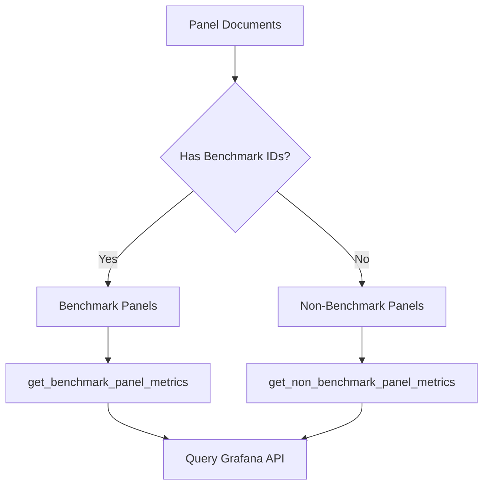
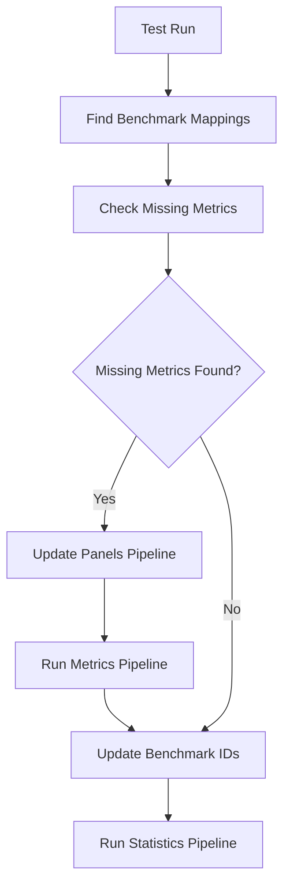

# Metrics Pipeline Documentation

## Overview

The Metrics Pipeline is responsible for extracting, transforming, and storing time-series metric data from Grafana dashboards for performance test analysis. It serves as a critical component in the Perfana DS (Data Science) platform, enabling automated collection and processing of performance metrics from various monitoring dashboards.

## Core Components

The metrics pipeline consists of several interconnected modules located in `/src/perfana_ds/pipelines/metrics/`:

- **`pipeline.py`** - Main orchestration and entry points
- **`nodes.py`** - Core metric processing logic
- **`query_panels.py`** - Grafana API interactions and data retrieval
- **`format_result.py`** - Data transformation and formatting
- **`reevaluate.py`** - Benchmark re-evaluation and updates
- **`clean.py`** - Data cleaning and deduplication utilities

## Main Entry Points

### 1. `run_metrics_pipeline()`

Primary function for extracting metrics from test run panel data.

**Parameters:**
- `test_run_id`: Target test run identifier
- `benchmarks_only`: Flag to process only benchmark panels (default: False)
- `panel_documents`: Optional pre-loaded panel documents

**Data Flow:**
1. Loads test run metadata from catalog
2. Retrieves panel documents (if not provided)
3. Processes benchmark panels first
4. Optionally processes non-benchmark panels
5. Saves metrics to `dsMetrics` collection

### 2. `run_reevaluate_pipeline()`

Specialized pipeline for re-evaluating metrics with updated benchmark configurations.

**Purpose:**
- Updates existing metrics with current benchmark IDs
- Creates missing panel/metric documents for benchmarks
- Triggers perfana-check evaluation even without new data

**Data Flow:**
1. Finds benchmark mappings for test run
2. Identifies missing benchmark metrics
3. Creates missing panels if needed
4. Runs metrics pipeline for missing data
5. Updates benchmark IDs for existing documents
6. Triggers statistics pipeline

## Core Processing Flow

### Phase 1: Panel Classification



### Phase 2: Grafana Data Retrieval

The pipeline queries Grafana APIs to extract time-series data:

1. **Authentication**: Retrieves Grafana API key from MongoDB
2. **Batching**: Groups multiple panel queries into batches for efficiency
3. **Async Requests**: Makes concurrent HTTP requests to Grafana
4. **Error Handling**: Captures and logs API errors per panel/query

**Key Features:**
- Configurable batch sizes and concurrency limits
- Automatic retry logic for failed requests
- Per-panel error tracking and reporting
- Support for multiple datasource types (primarily Prometheus)

### Phase 3: Data Transformation

Raw Grafana responses undergo several transformation steps:

1. **Frame Processing**: Extracts data from Grafana's frame format
2. **Timestamp Conversion**: Converts Unix timestamps to UTC datetime objects
3. **DataFrame Creation**: Transforms wide-format data to long-format metrics
4. **Metadata Enrichment**: Adds test run context (timestep, ramp-up flags)
5. **Deduplication**: Combines duplicate metric documents

**Data Schema Transformation:**
```
Grafana Frame Format → Pandas DataFrame → PanelMetricsDocument
```

### Phase 4: Storage and Validation

Processed metrics are validated and stored:

1. **Schema Validation**: Ensures data conforms to `PanelMetricsDocument` schema
2. **Duplicate Handling**: Combines metrics from multiple queries for same panel
3. **Database Storage**: Saves to `dsMetrics` MongoDB collection
4. **Error Documentation**: Stores panel-level errors for debugging

## Data Models

### Input Data
- **TestRun**: Test execution metadata (start/end times, environment)
- **PanelDocument**: Grafana panel configuration and query definitions
- **Datasource**: Grafana datasource configurations

### Output Data
- **PanelMetricsDocument**: Structured time-series data with metadata
  - `test_run_id`: Test run identifier
  - `application_dashboard_id`: Dashboard reference
  - `panel_id`: Panel identifier
  - `data`: Array of time-series points
  - `benchmark_ids`: Associated benchmark identifiers (if applicable)

### Time-Series Data Points
Each metric data point contains:
- `time`: UTC timestamp
- `metric_name`: Metric identifier
- `value`: Numeric measurement
- `timestep`: Seconds since test start
- `ramp_up`: Boolean flag for ramp-up period

## Benchmark Integration

### Benchmark Mapping Process

The pipeline integrates with the benchmark system to:

1. **Map Benchmarks**: Links panel/metric combinations to benchmark configurations
2. **Identify Missing Data**: Finds panels with benchmarks but no metric data
3. **Update References**: Adds benchmark IDs to existing metric documents
4. **Trigger Evaluation**: Enables perfana-check to evaluate benchmark compliance

### Re-evaluation Workflow



## Error Handling and Resilience

### Error Types
1. **Network Errors**: HTTP request failures to Grafana
2. **API Errors**: Grafana query execution errors
3. **Data Errors**: Invalid or malformed response data
4. **Validation Errors**: Schema validation failures

### Error Storage
Errors are captured and stored within panel documents:
```json
{
  "errors": [{
    "target_index": 0,
    "status_code": 500,
    "message": "Query execution failed",
    "type": "requestError"
  }]
}
```

### Graceful Degradation
- Failed panels don't stop entire pipeline execution
- Partial data is preserved when possible
- Error details are logged for debugging
- Empty metric documents are created for failed panels

## Performance Optimizations

### Async Processing
- Concurrent Grafana API requests
- Configurable connection limits and timeouts
- Request batching to reduce API overhead

### Data Efficiency
- Duplicate detection and merging
- Optimized DataFrame operations
- Selective column processing (removes string columns)

### Configuration Parameters
- `GRAFANA_BATCH_SIZE`: Number of panels per API request
- `GRAFANA_CONCURRENCY`: Maximum concurrent connections
- Request timeout and retry settings

## Integration Points

### Upstream Dependencies
- **Panels Pipeline**: Provides panel documents with query configurations
- **Test Runs**: Provides test execution metadata
- **Grafana API**: Source of time-series metric data

### Downstream Consumers
- **Statistics Pipeline**: Processes metric data for statistical analysis
- **ADAPT Pipeline**: Uses metrics for performance regression detection
- **Perfana-Check**: Evaluates benchmark compliance

## Configuration and Setup

### Required Environment Variables
- `GRAFANA_URL`: Base URL for Grafana instance
- `GRAFANA_BATCH_SIZE`: API request batching configuration
- `GRAFANA_CONCURRENCY`: Concurrent connection limits

### Database Collections
- **Input**: `dsPanels`, `testRuns`, `grafanas`, `benchmarks`
- **Output**: `dsMetrics`

## Common Use Cases

### 1. Standard Test Run Processing
```python
metrics = run_metrics_pipeline(test_run_id="test123")
```

### 2. Benchmark-Only Processing
```python
metrics = run_metrics_pipeline(
    test_run_id="test123",
    benchmarks_only=True
)
```

### 3. Re-evaluation with Updated Benchmarks
```python
metrics = run_reevaluate_pipeline(test_run_id="test123")
```

## Monitoring and Debugging

### Logging
The pipeline provides detailed logging at various levels:
- Request/response counts and timing
- Error details with context
- Processing statistics

### Key Metrics to Monitor
- Number of panels processed
- API request success/failure rates
- Data transformation timing
- Storage operation results

## Future Enhancements

### Potential Improvements
1. **Multi-Datasource Support**: Extend beyond Prometheus
2. **Caching Layer**: Cache frequently accessed panel configurations
3. **Stream Processing**: Real-time metric ingestion
4. **Data Validation**: Enhanced schema validation and data quality checks
5. **Metrics Metadata**: Enriched metric descriptions and units

### Scalability Considerations
- Horizontal scaling through distributed processing
- Database sharding for large metric volumes
- Optimized query patterns for high-frequency access
